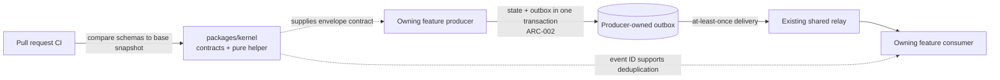

# 01.4.03-S1 — Event version overlap (arc42 story record)

> Story: **A module developer adds a new event version while the old one keeps flowing.**
> Scope: Shared Kernel contracts, compatibility check, and CI wiring.
> Record reviewed: 2026-10-06. Squid is the source of backlog status; this file does not change it.

This is a story-sized arc42 record. It captures only architecture decisions and evidence needed for this story; repository-wide architecture remains in `architecture.yaml` and `.agent/` guides.

## 1. Introduction and goals

Allow a producer to introduce a new event version while existing consumers continue to use the old version. Catch breaking edits to an already-published version before merge.

**Story acceptance criteria from Squid**

1. `TaskUpdated` v2 exists beside v1; a change emits both and a v1 consumer continues to receive v1.
2. Removing/changing a field in a published version fails CI and identifies the event, version, and field.

The local Shared Kernel seam and CI guard are implemented and have focused test evidence. The repository has no production `TaskUpdated` producer, outbox path, or consumer, so criterion 1 is not yet verified end to end. Hosted CI, independent review, and Squid evidence are also outstanding; do not call the story fully complete on local tests alone.

## 2. Architecture constraints

- Follow feature ownership and explicit dependency direction from `AGENTS.md`, `architecture.yaml`, and `.agent/instructions/architecture.md`.
- ADR-007 / ARC-002: the owning producer writes its state change and outbox record in one transaction.
- ARC-006: consumers deduplicate at-least-once delivery by event ID.
- ARC-010: old and new versions overlap for one release.
- Shared Kernel owns types, registry, and pure helpers; it does not own producer state, persistence, relay, or consumer code.
- Squid defines common envelope fields but no event-specific payload shape. The owning module must define payload schemas; this change does not invent them.

## 3. System scope and contex



Solid lines describe the intended production event path, not code present in this checkout. The dashed lines show what this story implements. No outbox, relay, or module consumer is added here.

## 4. Solution strategy

1. Define a typed envelope and a registry for the Wave 1 event families.
2. Provide a pure helper that creates multiple registered versions with shared metadata for a producer's overlap release.
3. Derive JSON Schema for registered versions, keep a checked-in release snapshot, and compare changes to the PR base snapshot.
4. Reject changes to a published version with event/version/field diagnostics; allow a new version alongside the old one.
5. Keep publication and delivery in the owning feature and record the missing production integration as follow-up rather than simulating it as production behavior.

## 5. Building-block view and repository map

```tex
packages/kernel/src/events/envelope.ts
  └─ envelope and version payload types
packages/kernel/src/events/registry.ts
  └─ event names and supported versions
packages/kernel/src/events/versioned-envelope.ts
  └─ validates registered, distinct versions; builds overlap envelopes
packages/kernel/src/events/schema.ts
  └─ derives schemas for registered versions
packages/kernel/src/events/compatibility.ts
  └─ pure baseline/current schema comparison and diagnostics
packages/kernel/src/index.ts → src/events/index.ts
  └─ controlled public exports
packages/kernel/contracts/event-schemas.snapshot.json
  └─ published schema baseline
packages/kernel/scripts/check-event-contract-compatibility.ts
  └─ verifies snapshot freshness and compatibility against a baseline
packages/kernel/tests/events.test.ts
  └─ registry and overlap contract seam tests
packages/kernel/tests/compatibility.test.ts
  └─ compatibility behavior and diagnostic tests
packages/kernel/README.md
  └─ developer workflow for adding and retiring versions
.github/workflows/control-plane.yml
  └─ invokes the contract check for pull requests
```

**Connection path:** public exports expose the envelope/registry/helper; schemas are derived from the registry; the snapshot records published schemas; the CLI compares current schemas with that snapshot and the PR base; the workflow runs the CLI. The owning feature would call the helper before writing both versioned events through its own outbox transaction. That final production connection is not present in this repository.

## 6. Runtime view

**Implemented contract seam:** producer supplies shared metadata and registered version/payload pairs → helper rejects unknown or duplicate versions → helper returns one envelope per requested version with the same event ID and type → the fixture hands them to an in-memory sink → a v1 selector reads v1.

**Not implemented here:** feature state change → transactional outbox → relay → real consumer. The in-memory fixture proves the kernel hand-off contract only; it is not evidence that production publishes or delivers these events.

**CI path:** generate schemas from registry → ensure checked-in snapshot matches → load base-branch snapshot → compare each published event/version → emit event/version/field diagnostics and fail on a breaking change.

## 7. Deployment view

No new runtime service, database, collection, broker, or deployment unit is introduced. The kernel package is consumed within the monorepo. The compatibility script runs as a build/CI check in `.github/workflows/control-plane.yml`; a successful hosted run for this branch has not been recorded.

## 8. Cross-cutting concepts

- **Data ownership:** Shared Kernel owns contract definitions only. Each feature owns its event payload, state transition, outbox, and consumer subscription.
- **Boundaries/modularity:** pure contract and comparison code stays in `packages/kernel`; no framework, database, or feature imports are needed.
- **Communication:** versioned envelopes share an event ID and metadata; overlap preserves the old schema while a new version is introduced.
- **Security:** no new endpoint, trust crossing, or persisted tenant collection. Event authorization remains with the owning producer/consumer boundaries.
- **Immutability:** envelope objects and returned arrays are frozen at the top level. Nested actor/payload values are not deep-frozen; callers must treat contract values as immutable. Tests currently verify top-level freezing only.
- **Failure behavior:** unknown and duplicate overlap versions throw; schema incompatibility exits CI non-zero with a field-level diagnostic.

## 9. Architecture decisions

| Decision | Reason / evidence |
| --- | --- |
| Put Shared Kernel implementation in `packages/kernel` | No kernel workspace existed; this is the repository's reusable-package location and avoids a second root source tree. |
| Keep payload schemas owner-defined | Squid specifies envelope fields, not payload contracts; inventing fields would produce false compatibility guarantees. |
| Keep producer/outbox/relay outside the kernel | ADR-007 / ARC-002 and module ownership put state and outbox writes in the producer's transaction. |
| Compare against the PR base snapshot | Prevents a changed branch snapshot from hiding an incompatible edit to a published version. |
| Permit a new version while protecting old versions | Meets the one-release overlap rule in ARC-010. |

## 10. Quality requirements and verification

| Requirement | Evidence / current status |
| --- | --- |
| Old consumer remains compatible during overlap | Local test creates v1/v2 envelopes and selects v1 from an in-memory sink. Production delivery remains unverified. |
| Published schema break is rejected clearly | Compatibility tests cover removed/changed fields, requiredness, removed events/versions, and a new version. Negative CLI test emitted the expected event/version/field diagnostic. |
| Deterministic published contract | Registry schemas are compared with the checked-in JSON snapshot and PR base snapshot. |
| Focused local validation | S1 suites: 11 passed, 0 failed (`events.test.ts`, `compatibility.test.ts`) on 2026-10-06. |
| Hosted governance and review | Hosted CI and independent engineer review are pending. |
| Squid acceptance tracking | At last review, story showed criteria 2/2, tasks 2/2, steps 0/8, cases 0/2, DoD 0/9, lenses 0. No Squid fields were changed. |

## 11. Risks and follow-up

- **Production overlap not proven:** when owner-feature producer/consumer contracts exist, connect the helper to that producer's transactional outbox and verify v1/v2 delivery and consumer deduplication. Do not add a fake publisher to the Shared Kernel.
- **Payload schemas are placeholders:** generic `{}` actor/payload schemas cannot guard undeclared event-specific fields. Add precise schemas only when the owning module contract supplies them.
- **Squid evidence is incomplete:** record steps, acceptance cases, applicable lenses, hosted CI, and review with the team when those results exist. Local documentation does not tick them.
- **Existing unrelated boundary findings:** invitation-feature `mongoose` boundary findings were observed separately and are not changed by this story.
- **Shallow immutability:** if the contract requires runtime immutability of nested payload data, make that an explicit contract decision and add tests before changing helper semantics.

## 12. Glossary

- **Envelope:** common event metadata plus a versioned payload.
- **Overlap release:** the release in which old and new versions are both available.
- **Published snapshot:** checked-in JSON representation used as the compatibility baseline.
- **Owner feature:** module responsible for producing or consuming a particular event contract.

## Squid lens assessment (current architecture lenses)

Squid's live architecture currently lists 13 lenses. Story applicability is assessed here; no lens has been attached or marked complete in Squid.

| Lens | Relevance to this story | Evidence / remaining obligation |
| --- | --- | --- |
| Engineering | Applies | Kernel boundary and PR compatibility check are implemented; hosted governance CI remains pending. |
| Product & Business | Applies | Outcome is safe event evolution without breaking existing consumers; no separate business workflow is changed. |
| UX | Not applicable | No user-facing state or screen changes. |
| Developer Experience | Applies | Public types, CLI diagnostics, and `packages/kernel/README.md` guide the module developer. |
| Security | Limited | No new entry point or trust boundary; confirm repository security gate in CI. |
| Data | Applies | Contracts and snapshot are versioned data; payload ownership is explicitly left to producer modules. |
| Reliability & Resilience | Applies to eventual delivery | At-least-once/idempotency rules are documented, but the real outbox/consumer path is outside this implementation. |
| Performance | No new runtime cost introduced | No benchmark needed for this contract-only change; assess when production fan-out changes. |
| Scalability | No new unbounded runtime store/queue | Revisit with the owning delivery implementation. |
| Operations | Not applicable to this slice | No worker, queue, or scheduled job is introduced. |
| Cost | Not applicable to this slice | No metered provider call or new runtime resource. |
| Compliance & Governance | Applies | PR compatibility gate is wired; hosted CI and review evidence remain pending. |
| Accessibility | Not applicable | No interactive surface. |

## Building-block and principle check

| Building block / principle | Applied here |
| --- | --- |
| Domain / Data | Shared event schema and release snapshot; payload schema stays with its owning feature. |
| Boundaries | Kernel exports contracts; feature owns state/outbox/consumer; CI owns build-time compatibility enforcement. |
| Communication | Versioned envelope, shared event ID, overlap helper; real transport is not implemented by this story. |
| Security | No new entry point or trust crossing; existing security CI evidence remains outstanding. |
| Modularity | Feature-first package boundary, pure helpers, explicit public exports. |
| Quality Attributes | Compatibility, deterministic diagnostics, and release overlap are tested locally; end-to-end reliability is pending producer integration. |
| Explicit Data Ownership | Registry/schema belongs to kernel; payload and outbox belong to the producer module. |
| Separation of Concerns | Contract checking has no framework/database dependency and does not publish events. |
| Idempotency Where Required | Event ID supports consumer deduplication; actual consumer behavior is not part of this package. |
| Prefer Simplicity | No broker or runtime component added for a contract/CI task. |
| Observability | No asynchronous runtime path was added; operational signals belong to the future delivery owner. |

## Record history

- 2026-10-03–04: T1/T2 scope, implementation, tests, and initial gate evidence recorded.
- 2026-10-06: Rechecked S1 tests and repository production references; added arc42 views, file/flow maps, current Squid lens applicability, and explicit local-vs-production verification boundary.
