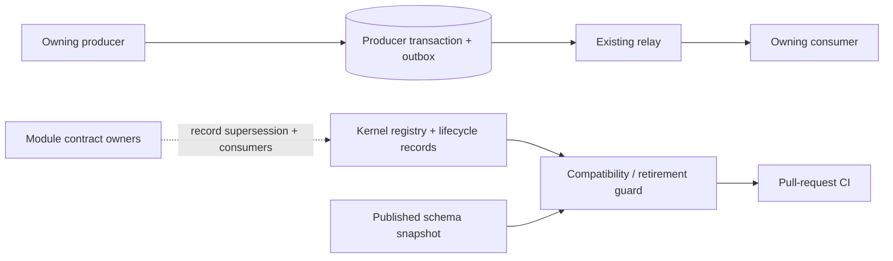

# 01.4.03-S2 — Story context and gate plan

## Story intent

**An old event version is retired only after its one-release overlap.** Event evolution must give existing consumers the promised overlap release and must not remove a version while a consumer still relies on it. A build should explain why a retirement is too early or which consumer prevents it.

## Story definition of done

Squid shows 0/9 Definition of Done checks at documentation time. The displayed checks are:

1. Implementation steps are ticked or explicitly dropped with a reason.
2. Dependency guardrail, policy-binding check, and collection allow-list pass in CI.
3. Tenant isolation is proven for any new collection the story touched.
4. New asynchronous paths have a signal, threshold, and runbook line.
5. New interactive surfaces have a recorded keyboard walk.
6. Deferred discoveries are written into the backlog.
7. At least one other engineer reviews and approves the change.
8. Affected module contract, runbook, and user-facing documentation are updated.
9. No new critical or high security findings are present.

Applicability must be assessed against the actual implementation. For example, if no collection, asynchronous path, or interactive surface is introduced, document why those checks do not apply rather than claiming a test ran. Do not tick Squid items from this local plan.

## Acceptance criteria

1. Removing `MemberAdded` v1 in the same release that introduces v2 fails and identifies the event, both versions, and the earliest release when v1 may be removed.
2. After v1 and v2 have both been published through the full overlap release, removing v1 in the following release passes if no consumer uses v1; only v2 is published afterwards.
3. Removing v1 after the overlap still fails while Access subscribes to it, and the diagnostic names Access.

These are the story's three integration cases in the Sprint 1 backlog export: `TC-01.4.03-S2-1`, `TC-01.4.03-S2-2`, and `TC-01.4.03-S2-3`. All were unrecorded at documentation time.

## Context and constraints

- S1 establishes the event envelope/registry and compatibility check. S2 adds lifecycle metadata and safe retirement based on release overlap and consumer use.
- ARC-010's one-release overlap is the key lifecycle constraint. Existing compatibility policy still prevents editing a published version's schema in place.
- Producers own publication and their transactional outbox (ADR-007 / ARC-002); consumers deduplicate by event ID (ARC-006). The kernel retirement guard must not take over producer, outbox, relay, or consumer runtime ownership.
- The current registry/backlog does not define extra payload fields for these acceptance examples; do not make up production payload shape to exercise retirement behavior.
- S2's implementation record must distinguish a code-level dependency on the S1 registry/guard from any formal dependency edge in Squid.

## Tasks and slice

| Task | Purpose | Story evidence |
|---|---|---|
| `01.4.03-S2-T1` — Retire an old event version only after its overlap | Record superseding release and consumers; reject retirement while overlap remains or a consumer still uses the version; document policy in the kernel Events clause. | Implements the three acceptance behaviors. |
| `01.4.03-S2-T2` — Automate the acceptance checks for this story | Turn all three story cases into deterministic automated checks against the actual retirement behavior. | Provides repeatable regression evidence for the same cases. |

The story has 2 tasks, 8 steps, 3 story cases, and 9 DoD checks according to the live board at documentation time. Both tasks were Open with 0/4 steps; T1 showed 0/3 task cases and T2 showed 0 task-level cases.

## Dependencies and repository state

- Squid does not list an incoming dependency for this story, and its blocked flag is not set.
- The technical predecessor is the S1 Shared Kernel registry/compatibility work. The local checkout currently contains S1 changes as uncommitted files; they are not in this S2 branch's commit history. Shared files showing in the working directory do not mean S1 has been merged. Confirm branch/base integration before treating validation as isolated S2 evidence.
- No code, test, or Squid state was changed while preparing this plan.

## Gate plan

| Gate | Evidence required | Current record |
|---|---|---|
| S2 T1 release/consumer behavior | Boundary tests for same-release rejection, eligible next-release removal, and active-consumer rejection. | Implemented and locally verified: 14 kernel tests, TypeScript typecheck, contract compatibility check, and syntax check pass. Hosted CI and independent review remain pending. |
| S2 T2 automated story cases | One automated check per story acceptance criterion; confirm expected pre-change failures, pass after implementation, and run in PR CI. | Three checks are in the dedicated T2 test file and pass locally. An isolated missing-guard baseline made all three fail on their criterion-specific assertions; the original historical red run was not captured. PR CI wiring is present; hosted CI remains pending. Squid remains Planned at 0/4 steps and 0 task-level cases. See the T2 task record. |
| Kernel compatibility preserved | Existing S1 checks still reject edits to published schemas while allowing a new version beside the old one. | Must be rerun after implementation and after S1 integration is resolved. |
| Architecture and local validation | Relevant control-plane test/typecheck/lint and architecture checks pass. | Not run for S2. |
| Hosted CI | Required checks pass on the actual branch with its intended base. | Pending. |
| Independent review | Another engineer reviews and approves the resulting change. | Pending. |
| Documentation | Kernel Events contract explains when a version can be retired; affected docs are current. | Kernel README now describes the release/consumer registry and retirement rule. Further affected docs are pending review. |
| Security / remaining DoD checks | Record scan result and applicability evidence for collections, async work, UI, and deferred findings. | Not assessed for S2 implementation yet. |
| Squid recording | Record truthful step and test outcomes after evidence exists. | No Squid values changed. |

## Scope boundaries and follow-up

- Do not claim the story complete from documentation or local test output alone; hosted CI, independent review, applicable DoD gates, and truthful Squid recording remain separate evidence.
- If a genuine additional dependency or deferred issue is discovered, record it in the Squid backlog per team process; do not hide it in code comments.
- T2's exact four Squid step captions and its story criteria are recorded in the separate T2 task document. An isolated missing-guard run now records criterion-specific red results; hosted CI remains pending.
- When S1's changes are integrated into this branch's history, rerun the S2 validation against that real base and update the records with actual outcomes.

## Arc42 story architecture record — review 2026-10-06

This is a story-scoped architecture view, not a second copy of the repository's permanent architecture. Repository-wide policy remains in `architecture.yaml` and `.agent/`.

### 1. Introduction and goals

Retire an old event version only after the full overlap release has elapsed and no consumer remains registered. Rejected removals must explain the event/version and either the earliest permitted release or the consumer blocking removal.

### 2. Constraints

- ARC-010 defines the one-release overlap; the compatibility guard must preserve it.
- ARC-002 / ADR-007 keep producer state and outbox writes in one producer-owned transaction. ARC-006 keeps event-ID deduplication at the consumer.
- Shared Kernel owns lifecycle metadata and a pure compatibility guard. It does not own production publishers, outboxes, relays, or consumers.
- Payload and consumer facts must come from owning module contracts; acceptance fixtures are not production facts.

### 3. Context and scope

The first four nodes represent the surrounding event-delivery architecture, not a production path implemented by this story. S2 implements the lifecycle/guard-to-CI path. Module owners must maintain accurate consumer records.

### 4. Solution strategy

Store when an old version was superseded and which modules still consume it. During compatibility comparison, fail closed if lifecycle data is missing, the current release is not later than the supersession release, or consumers remain. Keep historical lifecycle entries after removing the active schema so the PR-base comparison can assess the retirement.

### 5. Building-block view and file connections

| File | Responsibility / connection |
| --- | --- |
| `packages/kernel/src/events/registry.ts` | Active event versions, used to build active lifecycle records and schemas. |
| `packages/kernel/src/events/lifecycle.ts` | Current release, historical overrides, consumer lists, release ordering, and the retirement block decision. |
| `packages/kernel/src/events/compatibility.ts` | Compares PR/base schemas; for removed versions calls the lifecycle decision and reports its reason. |
| `packages/kernel/src/events/schema.ts` | Derives active JSON schemas from the registry. |
| `packages/kernel/contracts/event-schemas.snapshot.json` | Published baseline consumed by the compatibility script. |
| `packages/kernel/scripts/check-event-contract-compatibility.ts` | Checks snapshot freshness and compares current contracts with a selected baseline. |
| `packages/kernel/tests/retirement-acceptance.test.ts` | Three deterministic examples for same-release rejection, eligible later release, and a remaining consumer. |
| `packages/kernel/README.md` | Documents lifecycle override and consumer registration maintenance. |
| `.github/workflows/control-plane.yml` | Runs compatibility checking and repository validation on pull requests. |

Connection: registry → active schemas/lifecycle view → compatibility comparer → script → pull-request workflow. A removal decision depends on lifecycle history and consumer data; workflow source is present, but hosted CI for this branch is not evidence yet.

### 6. Runtime view

There is no new runtime retirement process. At build time, the checker compares a candidate snapshot with the base snapshot. For each removed version it loads lifecycle data, checks overlap timing and consumers, then permits removal or emits a diagnostic. For an eligible removal, only the remaining active versions appear in the candidate schema. Production event delivery continues to belong to producer/relay/consumer modules.

### 7. Deployment view

No service, database, collection, queue, or deployment unit is added. The guard runs as a package script in CI. The release value is source configuration (`CURRENT_EVENT_RELEASE`); the team must advance it consistently with the release being checked.

### 8. Cross-cutting concepts

- **Ownership and data:** kernel owns contract/lifecycle metadata; module owners own and must report consumer subscriptions.
- **Boundary and modularity:** comparison is pure package code with no database/framework integration.
- **Communication and reliability:** retirement does not alter delivery; ARC-006 event-ID deduplication remains consumer-owned.
- **Security:** no new entry point, trust boundary, or tenant collection. Repository security gate still needs its real CI result.
- **Failure behavior:** missing lifecycle information blocks retirement; active overlap and remaining consumers block with actionable diagnostics.
- **Operational dependency:** a stale or incomplete consumer list can make a retirement unsafe. Existing code cannot discover external subscribers automatically.

### 9. Decisions

| Decision | Rationale |
| --- | --- |
| Keep lifecycle history after schema removal | The base/current comparison needs evidence to decide whether retirement is eligible. |
| Fail closed when lifecycle data is absent | Unknown release/consumer state must not silently permit a breaking removal. |
| Keep release and consumer values as explicit metadata | They are governance facts not derivable from the schema alone. |
| Test `MemberAdded`/`Access` with deterministic fixtures | Exercises the guard without pretending those are production registrations in this checkout. |

### 10. Quality requirements and current verification

| Requirement | Evidence / limit |
| --- | --- |
| Same-release removal rejected with earliest eligible release | AC-1 local test passes; names v1, v2, and R1.3. |
| Removal allowed after overlap when unused | AC-2 local test passes; confirms only v2 remains in the fixture. |
| Remaining consumer blocks removal | AC-3 local test passes and names `Access`. |
| Prior contract checks retained | Event and compatibility suites also pass. Combined focused result on 2026-10-06: **14 passed, 0 failed**. |
| Real consumer truth | Not verified: `Access` is test data and no production consumer registrations exist in this checkout. |
| Hosted workflow and independent review | Pending; local tests do not satisfy these gates. |
| Squid progress | No status, steps, test cases, or DoD checks were changed by this review. |

### 11. Risks and follow-up

- **Consumer inventory is manual:** confirm each owning module's actual subscriptions and update lifecycle metadata before any real retirement. Empty lists in this checkout do not prove external consumers have migrated.
- **Release configuration:** the local `CURRENT_EVENT_RELEASE` is `R1.0`, while acceptance scenarios use R1.2/R1.3 as test inputs. Before a production retirement, update the source release and lifecycle override from the approved release record; the fixture values do not update production configuration.
- **S1 branch integration:** the task records say S1 changes are visible as working-tree changes but are not in this branch's commit history. Re-run against the intended integrated base before treating the combined story as branch-ready.
- **External gates:** hosted CI, independent review, security findings, and truthful Squid recording remain outstanding.

### 12. Glossary

- **Superseded release:** release where the replacement version first becomes available.
- **Overlap release:** the release in which old and new versions coexist.
- **Retirement:** removal of an old version after overlap and after its consumer list is empty.
- **Lifecycle override:** retained governance facts that cannot be reconstructed from the active schema list.

### Current Squid lens assessment

Squid architecture lists 13 lenses. This is a local applicability assessment only; it does not attach/complete lenses in Squid.

| Lens | Assessment for S2 |
| --- | --- |
| Engineering | Applies: guard and CI source exist; hosted result pending. |
| Product & Business | Applies: protects consumers from premature contract retirement. |
| UX | Not applicable: no user-facing surface. |
| Developer Experience | Applies: failure message should say what blocks removal and when it can proceed. |
| Security | No new entry point or trust crossing; repository security result pending. |
| Data | Applies: lifecycle and consumer metadata must reflect owner contracts. |
| Reliability & Resilience | Applies to eventual delivery ownership; this guard does not validate live relay/consumer behavior. |
| Performance | No runtime hot path or data query added. |
| Scalability | No runtime collection/queue growth added. |
| Operations | No worker or scheduled process added. |
| Cost | No metered service or new deployed resource added. |
| Compliance & Governance | Applies: retirement requires auditable overlap and consumer facts; CI/review evidence pending. |
| Accessibility | Not applicable: no interactive surface. |

### Building blocks and principle check

| Building block / principle | Application |
| --- | --- |
| Domain / Data | Lifecycle metadata records supersession release and consumers; owners must maintain accuracy. |
| Boundaries | Kernel decides contract compatibility; features own subscription truth and runtime delivery. |
| Communication | Existing event versions/delivery remain intact until the retirement gate permits removal. |
| Security | No new trust crossing or persisted tenant data. |
| Modularity | Pure lifecycle policy is kept in the kernel package. |
| Quality Attributes | Fail-closed retirement checks and three acceptance scenarios; production consumer inventory remains a risk. |
| Explicit Data Ownership | Consumer facts belong to modules that subscribe, not an inferred empty kernel registry. |
| Separation of Concerns | Build-time policy check does not own runtime delivery. |
| Idempotency Where Required | Existing consumer deduplication remains ARC-006 owner behavior. |
| Prefer Simplicity | No new service or database was introduced. |
| Observability | No asynchronous runtime path was added; future delivery changes need their own signals/runbook. |

**Review outcome:** implementation has local deterministic evidence for the three acceptance scenarios. Do not mark S2 fully complete until consumer facts are validated for a real retirement and hosted CI, independent review, and team/Squid gates are satisfied.

**Record update:** 2026-10-06 — reviewed lifecycle guard, acceptance tests, package docs, and workflow wiring; reran the 14 focused kernel tests successfully.
