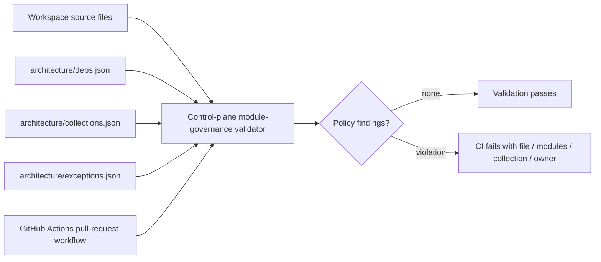

# 01.4.06-S1 — Story context and gate plan

## Story intent

**A module developer is told by the build the moment a change crosses a module boundary.**
CI must enforce the repository's module dependency and collection ownership rules so a
boundary violation is reported while the change is being built, rather than relying on
review to catch it.

## Story acceptance criteria

1. Given a change that uses only another module's published interface, when CI runs,
   the dependency and collection checks pass.
2. Given a change imports another module's `db/` folder, when CI runs, the build fails
   and names both modules and the offending file.
3. Given a change writes a collection owned by another module, when CI runs, the build
   fails and names the collection and its owner, unless an open exception covers it.

The story requirement also names imports of `next/*` from domain code as a forbidden
boundary crossing. Preserve that requirement when mapping the rules to automated checks.

## Context and constraints

- Squid requirement `REQ-01.4.06-1` is functional and cites `ARC-001`, `ARC-004`,
  `EX-01`, `EX-02`, and `R-01`.
- The story belongs to **Shared Kernel · Platform**, release `R1.0`, wave `W1 · Foundation`,
  and is estimated M / 3 points. Its slice is **By workflow step**: Create, Rename,
  Archive.
- Squid's architecture assessment says this is a CI-only guard over existing module
  boundaries and collection ownership. It introduces no runtime interface, collection,
  trust boundary, or request-path cost.
- Repository guidance assigns architecture policy and governance orchestration to the
  repository control plane. Existing `codebase/validators/architecture-boundaries.mjs`
  already checks several import and public-surface boundaries. The current repository
  scan did not find the story's proposed `architecture/deps.json` or
  `architecture/collections.json`; identify the authoritative dependency and collection
  registers before generating either file. Do not invent module edges, collection owners,
  or exceptions.
- Keep the CI checks deterministic and report the source module, target module, file,
  collection, or owner needed to fix a violation. Honor only recorded open exceptions.
- Do not change the story's acceptance criteria to make implementation pass.

## Dependencies and downstream work

- Squid lists **no incoming dependency**; this story can start without waiting.
- The story blocks `01.2.05-S3` (workspace tenant isolation) and `02.3.03-S1` (resource
  types and abilities). Those downstream stories are not prerequisites for this work.

## Task scope

- **T1 — Add the module-boundary and collection allow-list checks to CI:** define the
  dependency and collection ownership records, enforce dependency direction and
  gateway-to-owned-collection rules, and run those checks in CI.
- **T2 — Automate the acceptance checks for this story:** add automated checks for each
  acceptance criterion, prove the negative fixtures fail for the expected reason, then
  pass them against the implementation and run them on every pull request.

T1's implementation work and T2's acceptance-test automation are separate Squid tasks.
This document records story context; T1 and T2 have separate task records. Current
implementation and test evidence is summarized in the dated arc42 review below.

## Gate plan and current evidence

| Gate | Evidence / state at documentation |
| --- | --- |
| Ready Gate | Squid shows 10/10 met; this means ready to start, not complete. |
| T1 and T2 steps | Both tasks show Planned and 0/4 steps. |
| Acceptance criteria | 0/3 checked in Squid. |
| Story test cases | 0/3 passing/recorded in Squid; cases are Not run. |
| Story Definition of Done | 0/9 checked in Squid. |
| Architecture checks | Existing validator was inspected; the new dependency and collection ownership enforcement still needs implementation and verification. |
| Hosted CI and independent review | No evidence recorded yet. |

No test result, review, CI pass, or Squid completion tick is claimed by this planning
document.

## Story Definition of Done

Squid lists nine story-level gates. Keep evidence for each applicable gate:

1. Implementation steps are ticked or explicitly dropped with a reason.
2. Dependency guardrail, policy-binding check, and collection allow-list pass in CI.
3. Tenant isolation is proven for any new collection touched.
4. New asynchronous paths have a signal, threshold, and runbook line.
5. New interactive surfaces have a recorded keyboard walk.
6. Discoveries deferred from this change are written into the backlog.
7. At least one other engineer reviews and approves the change.
8. Affected module contract, runbook, and user-facing documentation are updated in the same change.
9. No new critical or high security findings are present.

Applicability must be assessed from the actual implementation; do not claim a gate is
complete merely because a particular kind of code was not planned.

## Scope boundaries

- This story adds build-time governance checks; it does not add a new application feature,
  runtime API, database collection, or service.
- Follow the repository's existing architecture and control-plane ownership. Extend the
  narrowest suitable repository-owned check unless inspection shows a standard tool is
  required; T1 allows dependency-cruiser **or equivalent**.
- Record any missing source-of-truth register or unresolved exception as a concrete
  blocker to resolve before enforcement, not as guessed policy.
- Do not mark tasks, cases, acceptance criteria, or Definition of Done complete in Squid
  from this local document.

## Arc42 story architecture record — review 2026-10-06

This records architecture specific to this story. Permanent repository rules remain in `architecture.yaml` and `.agent/`.

### 1. Introduction and goals

Make module dependency, private database imports, and collection ownership violations visible in build/CI diagnostics. Valid use of published interfaces and owned collections should pass. Preserve the story's `next/*`-from-domain restriction.

### 2. Constraints

- ARC-001: domain code must not import framework/database packages, including `next/*` in this story.
- ARC-004: every collection has one writing owner; cross-module access goes through the owner's published interface, except a recorded, in-scope exception.
- Exceptions must be explicitly registered and checked against operation, writer, collection, and expiry.
- Repository control plane owns repository policy; use the existing Node test runner and control-plane validation path.

### 3. Context and scope

The validator is a build-time check. It does not change runtime module access, add collections, or migrate existing code.

### 4. Solution strategy

Keep policy inputs in versioned JSON registers and implement the narrow repository-specific scan in the control plane. Resolve imports to modules and public exports; inspect collection declarations/accesses and evaluate explicit exceptions; return deterministic diagnostics. Run isolated acceptance fixtures in CI, then run broader repository validation separately so existing violations remain visible.

### 5. Building-block view and file connections

| File | Responsibility / connection |
| --- | --- |
| `architecture/deps.json` | Module dependency allow-list and Shared Kernel mapping, sourced from Squid architecture baseline v1.3. |
| `architecture/collections.json` | Single collection owner register, sourced from Squid data design. |
| `architecture/exceptions.json` | Scoped exceptions consumed by governance validator. |
| `codebase/validators/module-governance.mjs` | Reads all three registers; scans imports and collection accesses; emits findings. |
| `codebase/checks/workspace-checks.mjs` | Includes module governance in repository checks. |
| `codebase/validators/module-governance.test.mjs` | Unit coverage for policy parsing and rules. |
| `codebase/validators/module-governance.acceptance.test.mjs` | Story AC fixtures: valid public dependency, private `db/` import, foreign collection. |
| `.github/workflows/control-plane.yml` | Runs acceptance suite, then broader validation on PRs. |

Flow: policy registers + workspace files → validator → isolated tests and repository check → GitHub Actions result. Acceptance fixtures validate the rule; the full repository check can still fail on unrelated real source violations.

### 6. Runtime view

No application runtime path changes. At CI time, the checker loads policy JSON, validates register bindings, maps each workspace source file to an owning module, checks imports and collection markers, honors only a matching open exception, and reports violations. Missing or invalid policy input itself produces an error.

### 7. Deployment view

No service, database, or runtime deployment unit is added. This is control-plane code executed by the existing CI workflow. Hosted CI result for this branch remains pending.

### 8. Cross-cutting concepts

- **Ownership/data:** each collection has one registered writer; module IDs in dependency and exception registers must resolve.
- **Boundaries/modularity:** public feature entry points and package exports are distinguished from private paths.
- **Security/governance:** forbidden cross-module database access is blocked early; exceptions do not create general access.
- **Reliability:** malformed/missing governance registers fail with a finding instead of silently passing.
- **Test isolation:** seeded temporary workspaces exercise acceptance without requiring live application data or a database.

### 9. Decisions

| Decision | Reason |
| --- | --- |
| Use repository-owned validator | Module ownership and collection policy are repository-specific; control plane is the declared owner. |
| Use JSON registers | They are deterministic and fit the repository's dependency-light control-plane design. |
| Keep acceptance tests separate from repo-wide findings | Proves each story rule without confusing fixture results with existing unrelated violations. |
| Do not add exceptions for current violations | Only the Squid-recorded exception scope is authorized. |

### 10. Quality requirements and verification status

| Requirement | Evidence / current limit |
| --- | --- |
| Valid published interface and owned collection pass | Acceptance fixture exists; prior task record reports 3/3 acceptance cases passed. |
| Private `db/` import fails with modules and file | Acceptance fixture asserts diagnostic; prior task record reports pass. |
| Foreign collection write fails with collection and owner | Acceptance fixture asserts diagnostic; prior task record reports pass. |
| `next/*` in domain is rejected | Implemented in validator and covered by downstream S2 governance acceptance test. |
| CI runs checks on PR | Workflow source invokes story acceptance tests and `pnpm run validate`; hosted run pending. |
| Module-governance check | Passed after the 2026-10-06 ownership refactor; hosted CI remains unrun. |
| Review/security/Squid gates | Independent review, hosted CI, security evidence, and Squid recording are not implied by local test results. |

### 11. Risks and follow-up

- Identity/Workspace ownership was corrected during the 2026-10-06 follow-up; the repository check now reports no issues. Re-run hosted CI on the delivered branch.
- The exception register was synchronized during the 2026-10-06 review with the expiry dates in the inspected Squid architecture baseline: EX-01 `2027-09-28`, EX-02 `2027-03-28`. Recheck against Squid if the owner changes either date.
- Hosted CI, independent review, and actual Squid acceptance/DoD evidence remain separate gates.

### 12. Glossary

- **Public interface:** module/package export intended for other modules.
- **Collection owner:** the single module authorized to write a collection.
- **Recorded exception:** bounded policy entry that permits only specified operations within its recorded scope and active period.

### Current Squid lens assessment

This assessment does not attach or tick lenses in Squid.

| Lens | S1 relevance |
| --- | --- |
| Engineering | Applies: control-plane policy checks and CI diagnostics. |
| Product & Business | Indirect: protects module boundaries and ownership as the product grows. |
| UX | Not applicable: no user-facing surface. |
| Developer Experience | Applies: actionable file/module/owner diagnostics shorten feedback. |
| Security | Applies: private persistence access and domain/framework imports are constrained. |
| Data | Applies: single-writer collection register and exception scope. |
| Reliability & Resilience | Applies to fail-closed policy execution; no runtime delivery changed. |
| Performance | Build-time scan only; assess runtime cost as none introduced. |
| Scalability | No new runtime state or queue. |
| Operations | No new worker or operational process. |
| Cost | No new deployed or metered resource. |
| Compliance & Governance | Applies: policy source, exceptions, PR checks, and review evidence. |
| Accessibility | Not applicable: no interactive surface. |

### Building blocks and principle check

| Building block / principle | Application |
| --- | --- |
| Domain / Data | Dependency, collection-owner, and exception registers are explicit inputs. |
| Boundaries | Validator enforces imports and single-writer collection ownership. |
| Communication | Diagnostics point to the source file and violated target/owner. |
| Security | Restricts cross-module persistence and framework imports in domain code. |
| Modularity | Reuses the repository control plane rather than adding a separate orchestrator. |
| Quality Attributes | Deterministic focused tests; full repo findings remain separately visible. |
| Explicit Data Ownership | One owner per collection, checked from the register. |
| Separation of Concerns | Build-time guard only; no application runtime policy added. |
| Idempotency Where Required | Not applicable to this CI-only slice. |
| Prefer Simplicity | Node built-ins and repository-owned checks; no dependency-cruiser added. |
| Observability | CI diagnostics provide failure context; no async runtime path added. |

**Review outcome:** the implementation and acceptance tests are present, but overall story gates are not proven complete. Hosted CI, independent review, and Squid evidence remain pending.

### Follow-up — Identity collection ownership fix (2026-10-06)

- Added Identity's public API in `servers/api/features/identity/public.ts` and moved `users`/`invitations` models and Mongo operations into `servers/api/features/identity/integrations/identity.mongo.ts`.
- Workspace now calls that API within its existing Mongo transaction; Workspace still owns organization, workspace, and membership writes. Identity returns invitation data; Workspace looks up its own workspace and creates its own membership.
- Updated the control-plane dependency check to accept the explicit `public.ts` feature API required by the architecture-boundary check, and added a fixture for that import form.
- `node codebase/cli/repo.mjs check` — passed: no issues found.
- Focused Workspace tests — 9 passed, 0 failed, 1 live Mongo integration test skipped because the opt-in database test was not enabled.
- API TypeScript typecheck, governance acceptance suite (16/16), syntax check (57 files), and `git diff --check` passed.
- This resolves local Workspace→Identity collection findings; hosted CI, live Mongo integration, independent review, and remaining Squid gates are still outstanding.
