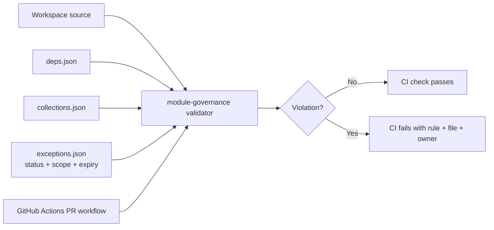

# 01.4.06-S2 — Only a recorded exception lets a change past a guardrail, and only as far as it says

## Story record

- **Story:** `01.4.06-S2` — Only a recorded exception lets a change past a guardrail,
  and only as far as it says.
- **Initiative / parent:** `01` → `01.4` → `01.4.06` — Fail the build when a change
  crosses a module boundary.
- **Squid state at documentation:** In progress; 0/2 tasks, 0/8 task steps, 0/4 story
  cases passing, and 0/9 Definition of Done checks. No Squid state or checkbox was
  changed.
- **Wave / release / size:** W1 · Foundation / R1.0 / S · 2 points.
- **Owner:** Shared Kernel · Platform; carried by Abdul Basit.
- **Record date:** 2026-10-05.

## Story intent

As a module developer on the platform team, I need recorded exceptions EX-01 and EX-02
to allow only their stated operation and scope, and domain code to reject framework
imports, so an exception cannot become a general hole and closing an exception reveals
every remaining use.

## Acceptance criteria

| Criterion | Expected behavior | Squid verification |
| --- | --- | --- |
| AC-1 | Workspace appending an outbox row inside `withTransaction` passes the collection check under EX-01. | CI check: allow-list fixture with an outbox append; `TC-01.4.06-S2-1`. |
| AC-2 | Workspace updating `publishedAt` on an outbox row fails; diagnostic names `outbox`, Shared Kernel as owner, and that EX-01 permits appends only. | CI check: allow-list fixture with an outbox update outside the relay; `TC-01.4.06-S2-2`. |
| AC-3 | `Identity/domain/` importing `next/headers` fails; diagnostic names the module, file, and ARC-001. | CI check: dependency-check fixture for a `next/*` import; `TC-01.4.06-S2-3`. |
| AC-4 | If EX-02 is closed while Billing still writes `workspaces.entitlements`, every such file fails and names `workspaces` and Workspace as owner. | CI check: register fixture with the exception removed; `TC-01.4.06-S2-4`. |

All four story cases are Integration checks and are currently marked **Not run** in
Squid.

## Requirements, dependencies, and downstream work

- **Requirement:** `REQ-01.4.06-1` (functional): CI rejects private module imports,
  forbidden `next/*` imports, and foreign collection access except where a recorded
  exception permits it. References: ARC-001, ARC-004, EX-01, EX-02, R-01.
- **Incoming story dependencies:** 0 in Squid. The story does not wait for another
  story; its guardrails build on the S1 module-governance validator already present in
  this branch.
- **Blocks:** `01.2.05-S3` and `02.3.03-S1`.
- **Task order:** T1 supplies the scoped/expiring exception behavior; T2 automates the
  four story acceptance cases against it. T2 therefore follows T1.

## Architecture and delivery constraints

- Squid rates architecture impact **No impact**. Keep the existing module boundaries,
  collection owners, and public interfaces unchanged; no runtime component, collection,
  API, or request-path work belongs here.
- This is Shared Kernel · Platform control-plane policy and test work. Reuse the
  repository-owned validator and existing PR pipeline; do not add an orchestrator,
  runtime service, or test framework.
- The guardrail must read exception scope and expiry from
  `architecture/exceptions.json`. The current branch stores EX-01 and EX-02 inside
  `architecture/collections.json`; T1 must move their source of truth into the named
  exceptions register rather than maintaining two independently editable copies.
- Current records say EX-01 allows module outbox appends and the Shared Kernel relay's
  `publishedAt` update; EX-02 allows Billing to update only `workspaces.entitlements`.
  The validator reads ISO expiry dates and rejects them once passed. During the
  2026-10-06 review, `architecture/exceptions.json` was synchronized with the dates
  shown in the inspected Squid architecture baseline: EX-01 expires `2027-09-28`, and
  EX-02 expires `2027-03-28`. Reconfirm these values with the policy owner if Squid changes.
- The current branch was created from `dev` at the same commit as `dev`. Squid's
  before-start guide says to pull the latest `main` and create a feature branch. Record
  that branch-base instruction discrepancy for resolution before delivery; this document
  does not change branches or fetch remote refs.

## Gate and start guidance

Squid's Ready Gate is 10/10 and says every condition is met. The story's gate plan also
records 10/10. Before implementation, its guide directs the developer to read the story,
all criteria including failure cases, design and cited decisions, and confirm those
preconditions in order.

## T1 and T2 records

- [T1 — Honour recorded exceptions in the guardrail checks](01.4.06-S2-T1-honour-recorded-exceptions-in-the-guardrail-checks.md)
- [T2 — Automate the acceptance checks for this story](01.4.06-S2-T2-automate-the-acceptance-checks-for-this-story.md)

## Implementation status

T1 guardrail and T2 acceptance suite are implemented locally. All 16 focused Node tests
passed in the last recorded run; syntax checks and `git diff --check` passed. The
repository-wide check still reports the known Workspace access to Identity-owned `users`
and `invitations`, outside S2. Expiry dates now match the inspected Squid baseline;
hosted CI and independent review have not run. Squid acceptance cases, task steps, and
Definition of Done were not ticked.

## Arc42 story architecture record — review 2026-10-06

Story-specific architecture record only; permanent repository rules remain in `architecture.yaml` and `.agent/`.

### 1. Introduction and goals

Allow a guardrail exception only for its recorded collection, owner, writer, operation, fields, transaction condition, and active period. Closing or expiring an exception must reveal remaining violations.

### 2. Constraints

- ARC-001 forbids framework/database imports from domain code; this story explicitly checks `next/*` and includes ARC-001 in the diagnostic.
- ARC-004 assigns one writer per collection except for precisely scoped, recorded exceptions.
- Only EX-01 and EX-02 from the architecture baseline are encoded; do not widen their scope.
- This is control-plane policy/testing. No runtime service, collection, endpoint, or test framework is added.

### 3. Context and scope

### 4. Solution strategy

Separate exception facts into one `architecture/exceptions.json` source. Validate its shape and bindings, then evaluate an exception only when open, unexpired, and matching the precise operation and scope. Run deterministic temporary-workspace acceptance tests in PR CI.

### 5. Building-block view and file connections

| File | Responsibility / connection |
| --- | --- |
| `architecture/deps.json` | Module identity and allowed dependency direction. |
| `architecture/collections.json` | Single collection owner register. |
| `architecture/exceptions.json` | EX-01/EX-02 scope, writer, operations, and expiry; single exception source. |
| `codebase/validators/module-governance.mjs` | Reads registers; checks expiry, transactional append, relay-only field update, Billing entitlement update, and domain imports. |
| `codebase/checks/workspace-checks.mjs` | Runs validator as part of repository checks. |
| `codebase/validators/module-governance.s2.acceptance.test.mjs` | Four isolated story-case fixtures, including multiple files after EX-02 closes. |
| `codebase/validators/module-governance.test.mjs` | Rule/unit coverage, including expired exception. |
| `.github/workflows/control-plane.yml` | Runs S1 and S2 acceptance suites and broader validation on PR. |

Flow: dependency/collection/exception registers + source → validator → fixture and repo checks → PR workflow. `architecture/exceptions.json` was synchronized on 2026-10-06 to inspected Squid expiry dates: EX-01 `2027-09-28`, EX-02 `2027-03-28`.

### 6. Runtime view

No application runtime path changed. During CI, the validator reads the registers and current UTC date. EX-01 allows module outbox appends only inside a detected transaction; the Shared Kernel relay is limited to `publishedAt` updates. EX-02 allows Billing to update only `workspaces.entitlements` while open and before expiry. Domain `next/*` imports fail with an ARC-001 diagnostic.

### 7. Deployment view

No runtime deployment or persisted application data is added. Policy validation runs in existing CI. Hosted execution remains pending.

### 8. Cross-cutting concepts

- **Data ownership:** collection owner is read from `collections.json`; exceptions cannot replace that ownership record.
- **Boundaries:** validator is repository-owned control-plane code, not a feature service.
- **Security/governance:** exception status, expiry, collection, writer, fields, and operation scope bound the allowed crossing.
- **Failure behavior:** expired, closed, invalid, or nonmatching exception does not authorize access; malformed policy produces an error.
- **Test isolation:** acceptance tests seed copied policy into temporary workspaces; no live DB is involved.

### 9. Decisions

| Decision | Reason |
| --- | --- |
| One dedicated exception register | Avoid divergent embedded copies and give status/expiry a single source. |
| Validate by exact operation and scope | Prevent an append exception from silently allowing updates. |
| Inject/test time in fixtures | Make expiry behavior deterministic without changing the system clock. |
| Keep known S1 ownership findings visible | S2 tests must not conceal unrelated Workspace-to-Identity accesses. |

### 10. Quality requirements and verification

| Requirement | Evidence / status |
| --- | --- |
| EX-01 transactional append is allowed; Workspace update is denied | AC-1/AC-2 acceptance tests recorded as passing locally. |
| Domain framework import names ARC-001 | AC-3 acceptance test recorded as passing locally. |
| Closing EX-02 reports every remaining Billing file | AC-4 test checks both files; recorded passing locally. |
| Expiry is enforced | Unit test covers an expired exception; configured dates now match inspected Squid values. |
| Focused local validation | Prior story record reports 16 Node tests passed; rerun below for current review. |
| Full repository check | Passed on 2026-10-06 after the separate Identity/Workspace ownership fix; hosted CI remains pending. |
| Hosted CI, review, Squid | Not verified/changed in this review. |

### 11. Risks and follow-up

- Reconfirm expiry dates with Squid/policy owner if source changes; once the dates pass, the guard will stop authorizing the exception automatically.
- The earlier Workspace→Identity `users`/`invitations` findings were resolved through Identity's public feature API, not by widening an exception. Keep this fix documented as separate S1/application work.
- The validator detects transaction scope from source patterns; maintain targeted tests if the transaction API shape changes.
- Hosted CI, independent review, security findings, and Squid case/DoD recording remain separate evidence gates.

### 12. Glossary

- **Exception:** a time-bounded policy allowance for specific ownership crossings.
- **Scope:** the exact writer, collection, operation, fields, and transaction conditions an exception permits.
- **Expired:** expiry date is at or before the validator's current UTC date.

### Current Squid lens assessment

Local assessment only; no lenses were attached or ticked in Squid.

| Lens | S2 relevance |
| --- | --- |
| Engineering | Applies: exact policy checks and CI integration. |
| Product & Business | Indirect: permits necessary temporary ownership crossings while retaining boundaries. |
| UX | Not applicable: no UI. |
| Developer Experience | Applies: diagnostic explains which exception failed and why. |
| Security | Applies: prevents exceptions becoming broad access paths. |
| Data | Applies: ownership and allowed writes are explicit. |
| Reliability & Resilience | Applies to fail-closed policy evaluation; no runtime delivery is changed. |
| Performance | CI-only work; no request-path cost. |
| Scalability | No runtime state growth. |
| Operations | No background worker or scheduled job. |
| Cost | No new external service or deployed resource. |
| Compliance & Governance | Applies: exception provenance, expiry, CI and review evidence. |
| Accessibility | Not applicable: no interactive surface. |

### Building blocks and principle check

| Building block / principle | Application |
| --- | --- |
| Domain / Data | Exception policy is an explicit versioned JSON register. |
| Boundaries | Guard permits only the recorded operation across collection ownership. |
| Communication | Failures identify the module, collection, owner, and exception scope. |
| Security | Closed, expired, or out-of-scope exceptions do not authorize access. |
| Modularity | Extends the existing control-plane validator and Node test conventions. |
| Quality Attributes | Deterministic tests cover allow, deny, close, expiry, and diagnostics. |
| Explicit Data Ownership | Owner stays authoritative in collections register; exceptions are narrow allowances. |
| Separation of Concerns | Build-time governance remains outside application request handling. |
| Idempotency Where Required | Not applicable to the validator; transaction requirement is checked for outbox append. |
| Prefer Simplicity | No general policy engine or third-party orchestrator added. |
| Observability | CI findings make policy failures actionable; no async runtime path added. |

**Review outcome:** local implementation and acceptance tests are recorded, with configured expiries synchronized to the inspected Squid baseline. Full repo findings, hosted CI, independent review, and team/Squid gates are still outstanding.

**Record update:** 2026-10-06 — reviewed source/register/test/CI links, synchronized EX expiry dates from the inspected Squid architecture record, and reran focused governance tests.

**Follow-up:** the separate Identity/Workspace collection-ownership fix made `node codebase/cli/repo.mjs check` pass with no findings on 2026-10-06. This does not replace hosted CI or review evidence.
